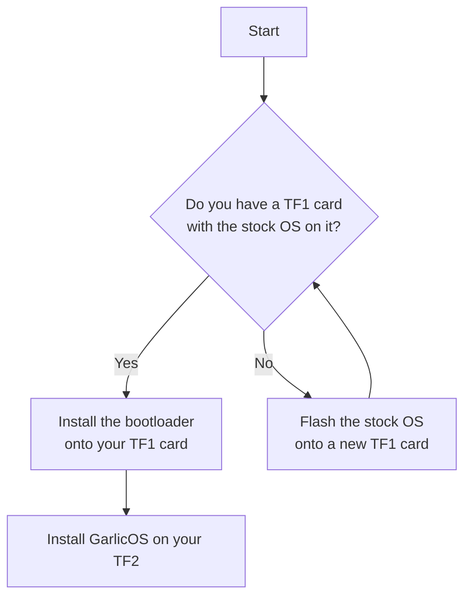

# Overview
This is a bootloader for the RG35XX+, RG35XXH, and RG28XX that allows you to boot into GarlicOS.

It is meant to be installed on the stock OS MicroSD card and will boot into the first valid operating system it finds.

## Installation and Setup

### A. Installing the bootloader onto the stock OS TF1 MicroSD card

If you already have a stock OS MicroSD card, or have created one, you can install the bootloader by following these steps. 

If you don't have a stock OS MicroSD card, you can create one by following the instructions provided under [section C](#c-creating-tf1-bootable-stock-os-microsd-cards).

1. Extract the [bootloader](https://github.com/GarlicOS/bootloader_anbernic_rg35xxplus/archive/refs/heads/master.zip) onto your **RG35XX+, RG35XXH or RG28XX's stock OS MicroSD card**.

2. Done correctly, you should have a `device-resources` folder and a `dmenu.bin` file at the root of you the larger `NO NAME` partition of your MicroSD card.

### B. Uninstalling the bootloader

If for any reason you want to uninstall the bootloader, you can do so in one step:

1. Remove the **device-resources folder** and **dmenu.bin file** from your **RG35XX+, RG35XXH or RG28XX's stock OS MicroSD card**.

### C. Creating TF1 bootable stock OS MicroSD cards

OnionOS requires two SD cards: your TF1 card should have the stock OS, and your TF2 card should have GarlicOS.

If you don't have a stock OS MicroSD card, or want to flash that OS onto a different card you can create one by following these steps:

1. Download the latest portable version of [Rufus](https://github.com/pbatard/rufus/releases/latest)
2. Download and extract the stock OS image ([RG35XX+](https://win.anbernic.com/download/318.html), [RG35XXH](https://win.anbernic.com/download/360.html), [RG28XX](https://win.anbernic.com/download/398.html)) with [7zip](https://www.7-zip.org/download.html)
3. Start **Rufus**
4. Select your **MicroSD card** in the **Device** dropdown
5. Click the **SELECT button** and select your extracted stock OS image
6. Click the **START button** to burn your MicroSD card

These instructions describe using Rufus, but you can use any tool you prefer to burn the stock OS image onto your MicroSD card.

Once you have your stock OS MicroSD card, you can install the bootloader by following the instructions provided under [section A](#a-installing-the-bootloader-onto-the-stock-os-tf1-microsd-card).

### D. Creating TF2 bootable MicroSD cards

Your TF2 card should will have GarlicOS on it.

To create a TF2 bootable MicroSD card:
1. Format it with an **ExFat** filesystem
2. Create a **boot** folder on it
3. Copy an OS **init** script of choice into the **boot** folder (ex. [GarlicOS](https://github.com/GarlicOS/init_template/raw/main/init))
4. Make sure that you have renamed the downloaded `init` script to `init` (no file extension). On MacOS, the filetype should be `Unix Executable File`. On Windows, the filetype should be `File`.
5. Extract the **armhf** OS **rootfs** file of choice into the **boot** folder with [7zip](https://www.7-zip.org/download.html) (ex. [GarlicOS](https://github.com/GarlicOS/buildroot/releases/latest))

## Boot order
The bootloader will boot the first valid operating system it finds in the following order:
1. TF2 (ex. [GarlicOS](https://github.com/GarlicOS/buildroot/releases/latest))
2. TF1 (ex. Anbernic's Stock OS ([RG35XX+](https://win.anbernic.com/download/318.html), [RG35XXH](https://win.anbernic.com/download/360.html), [RG28XX](https://win.anbernic.com/download/398.html)))
